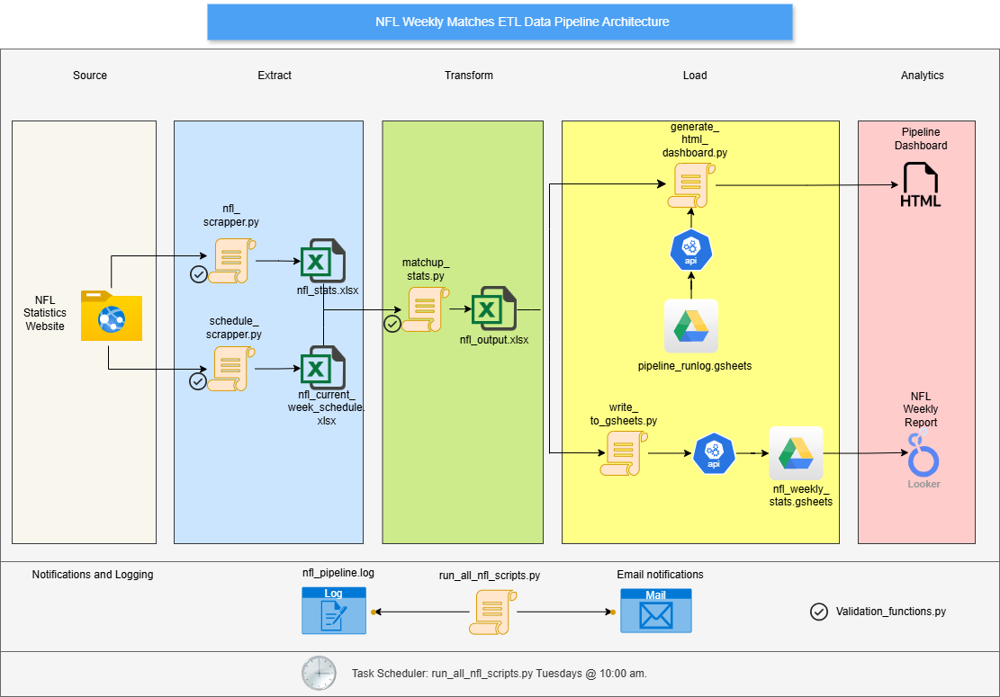
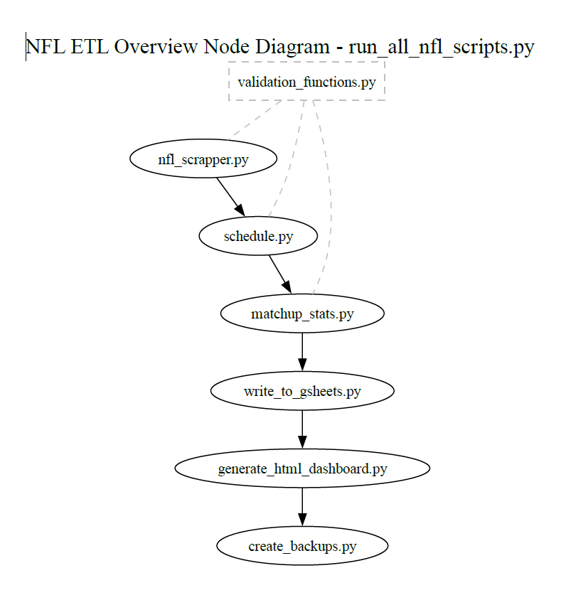

# 🏈 NFL Data Pipeline Project

This project is a comprehensive NFL Data Pipeline built to scrape, process, validate, store, and analyze NFL statistics and schedules, providing a dynamic dashboard for easy monitoring.

---

## 📝 Project Overview

The NFL Data Pipeline project is designed to extract, transform, and load (ETL) NFL data from public sources into a Google Sheets dashboard. The pipeline is robust, featuring data validation, error handling, logging, email notifications, and a local HTML dashboard for tracking pipeline performance. It is intended as a modular, reusable framework that can be expanded with additional data sources or analytics steps.

---

## ✨ Pipeline Features

The pipeline consists of the following main components:

1. **Data Extraction**:
   - Scrapes NFL stats and schedules from multiple sources using `requests` and `BeautifulSoup`.

2. **Data Transformation**:
   - Cleans, validates, and formats data for consistency and accuracy.
   - Joins relevant data to create a final, structured DataFrame for analysis.

3. **Data Loading**:
   - Exports transformed data into an Excel file.
   - Loads data to Google Sheets for dynamic dashboard visualization.
   
4. **Data Backup**:
   - Archives backups of the data to a local folder.

5. **Monitoring and Notifications**:
   - Logs key actions and errors to a local log file.
   - Sends email notifications upon pipeline completion or error.
   - Tracks pipeline status in a Google Sheets-based dashboard.

---

## 📂 Project Structure
Here's a breakdown of the key files and directories:
   ```plaintext
   .
   ├── backups/                         # Folder to store backup files
   │   ├── final_output/                # Final outputs backed up with timestamps
   │   └── weekly_output/               # Weekly outputs backed up with timestamps
   ├── nfl_scrapper.py                  # Script for scraping NFL statistics
   ├── schedule_scrapper.py             # Script for scraping NFL weekly schedule
   ├── matchup_stats.py                 # Processes and transforms scraped data
   ├── write_to_gsheets.py              # Uploads processed data to Google Sheets
   ├── generate_html_dashboard.py       # Generates an HTML dashboard from Google Sheets data
   ├── create_backups.py                # Script to backup files in local folders
   ├── validation_functions.py          # Validation functions for data integrity
   ├── run_all_scripts.py               # Orchestrates the pipeline and schedules tasks
   ├── generate_html_dashboard.py       # Generates HTML dashboard for monitoring
   ├── nfl_pipeline.log                 # Log file for pipeline actions and errors
   ├── requirements.txt                 # Python dependencies
   └── README.md                        # Project documentation
   ```

---

## 🔄 Project Architecture

### Pipeline Architecture

The architecture follows an **ETL** (Extract, Transform, Load) workflow:

1. **Extract**:
`nfl_scrapper.py` and `schedule_scrapper.py` gather data from NFL sources.
2. **Transform**:
`matchup_stats.py` processes and prepares data for analysis.
3. **Load**:
`write_to_gsheets.py` uploads data to Google Sheets.
4. **Monitor**:
`generate_html_dashboard.py` generates an HTML dashboard from the run log on Google Sheets.

### High-Level Overview

The pipeline follows a typical ETL architecture. Below is a high-level overview:



### Detailed Node-Based Diagram

This node-based diagram provides insight into the step-by-step structure of each script and function used in the pipeline:



---

## ⚙️ Setup and Installation
**Prerequisites**
Python 3.8+
Google Cloud Console for API credentials (ensure credentials.json is downloaded)
Graphviz (if using Graphviz for visualizations)
Google Sheets API enabled and credentials.json file in the project root.

**Installation Steps**
1. **Clone the Repository**:
   ```bash
   git clone https://github.com/yourusername/nfl-data-pipeline.git

2. **Setup the virtual environment**:
   ```bash
   python -m venv venv
   source venv/bin/activate  # On Windows: venv\Scripts\activate

3. **Install dependencies**:
   ```bash
   pip install -r requirements.txt

4. **Add enviromental variables in `.env`**:
   ```bash
   EMAIL=<your-email>
   EMAIL_PASSWORD=<your-email-password>
   RECEIVER_EMAIL=<receiver-email>
   SPREADSHEET_ID_LOG=<Google-Sheet-ID-for-log>
   SPREADSHEET_ID=<Google-Sheet-ID-for-data>

5. **Google API Setup**:

   * Set up a Google Cloud project and create a service account.
   * Download the `credentials.json` file for your service account and place it in the project root.

---
## 🚀 Usage
1. **Running Individual Scripts:** Each script performs a specific function in the pipeline. For example, to scrape data, run:
   ```bash
   python nfl_scrapper.py
2. **Running the Full Pipeline:** Use the main orchestration script to execute the full ETL pipeline:
   ```bash
   python run_all_scripts.py
3. **Generating the Dashboard:** Generate the HTML dashboard for monitoring pipeline status by running:
   ```bash
   python generate_html_dashboard.py

---
## 🕒 Automation and Scheduling
The pipeline is set up to run automatically every Tuesday at 10:00 am.

1. **Task Scheduler (Windows):**
   * Use Task Scheduler to schedule run_all_scripts.py.
   * Set the trigger to run weekly on Tuesdays at 10:00 am.
  
2. **Cron (Linux):** Add a cron job to schedule the pipeline:
   ```bash
   0 10 * * 2 /path/to/python /path/to/run_all_scripts.py

---
## 🛠️ Logging, Monitoring and Error Handling

- **Log File**: `nfl_pipeline.log` logs all major actions, including errors.
- **Google Sheets Dashboard**: Records pipeline run status, duration, and any error messages.
- **Monitoring:** The pipeline generates an HTML dashboard from Google Sheets, providing real-time insights into the pipeline's health.
- **Email Notifications**: Sends completion or error alerts to the configured email.

---

## 📊 Monitoring Dashboard
The pipeline uses a Google Sheets log to monitor each run’s status, duration, and errors. The `generate_html_dashboard.py` script converts this log into a visual HTML dashboard, enabling quick and easy monitoring of the pipeline.

---

## 📁 Backup System
Backup copies of data files are saved in the backups folder:

* **weekly_output**: Stores weekly outputs from the pipeline.
* **final_output**: Stores finalized data with a timestamp for historical tracking.

---

## 🤝 Contributing
Contributions are welcome! If you'd like to contribute, please follow these steps:

1. Fork the repository.
2. Create a feature branch (`git checkout -b feature/AmazingFeature`).
3. Commit your changes (`git commit -m 'Add some AmazingFeature'`).
4. Push to the branch (`git push origin feature/AmazingFeature`).
5. Open a pull request.


## 👍 Future Enhancements

- **Additional Pipelines**: Integrate other data sources (e.g., weather, player stats) to enrich NFL analysis.
- **Advanced Scheduling**: Use Airflow for better task scheduling and dependency management.
- **Data Storage Optimization**: Transition to SQL or NoSQL databases for scalable, long-term data storage.

---

## 📘 Requirements

The pipeline uses the following main libraries:

- `requests`
- `beautifulsoup4`
- `pandas`
- `gspread`
- `python-dotenv`
- `smtplib`
- `jinja2`

---

## 📃 License

This project is open-source and licensed under the MIT License.

